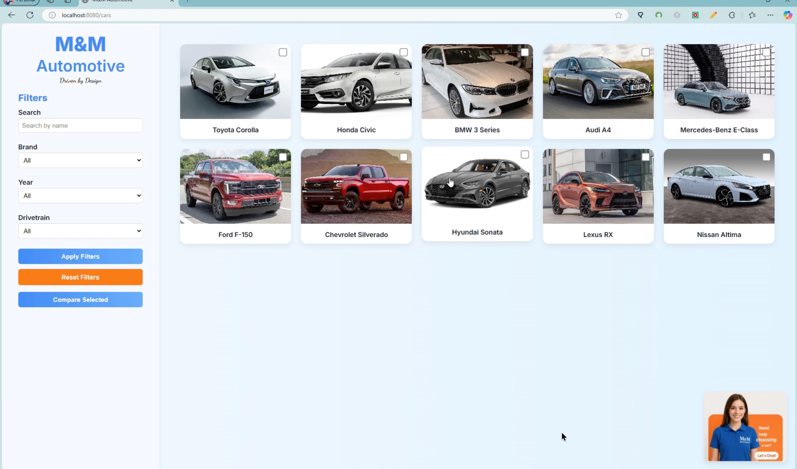
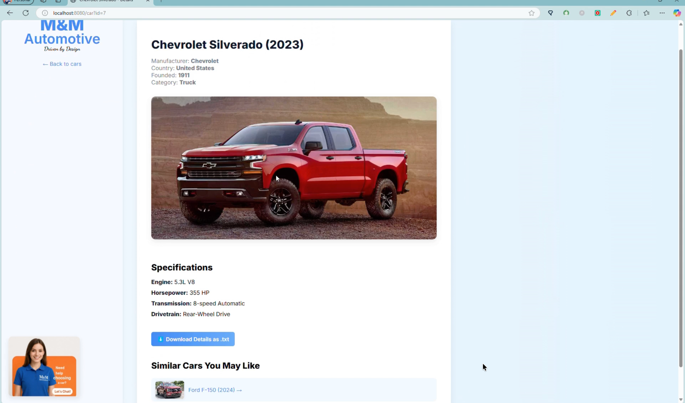
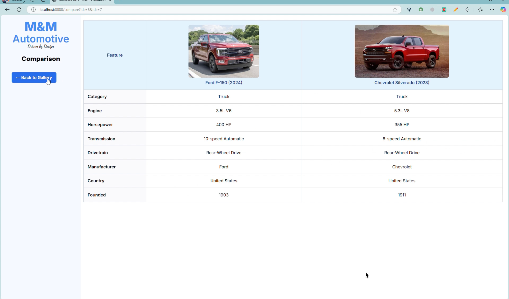
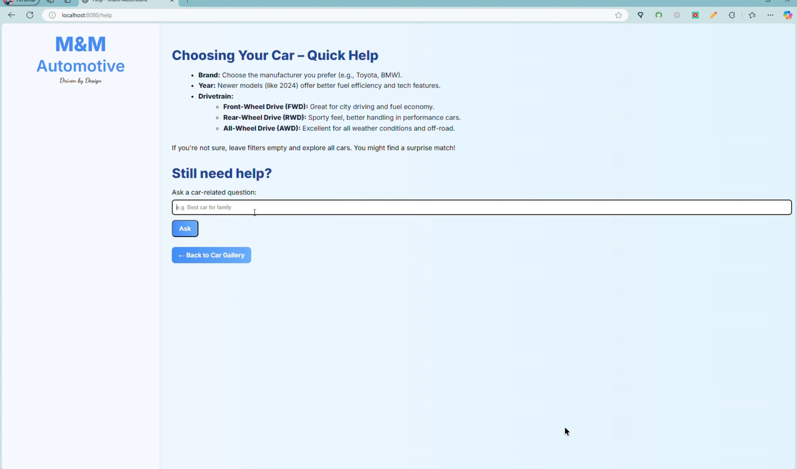

# M&M Automobile Viewer

A Go web application for browsing and exploring cars. It connects to an external API to display models, apply filters, compare vehicles, and use a built-in assistant—all with server-rendered HTML and no JavaScript.

---

## Featured Screenshots

<p align="center">
  
</p>

<p align="center">
  
  
  
</p>

---

## Project Overview

M&M Automobile Viewer lets users browse a car gallery, filter by brand, year, and drivetrain, compare cars side by side, and inspect detailed specs. The interface focuses on clarity and usability: all data comes from an external REST API, and the app is built with Go’s standard library and HTML templates only.

---

## Key Features

- **Car gallery** — Browse all models with a simple, scannable layout
- **Filters** — Narrow results by brand, year, and drivetrain
- **Side-by-side comparison** — Compare selected cars in one view
- **Download car info** — Export details as plain text
- **Similar cars** — See related models from the same make or category
- **Built-in assistant (CarBot)** — Get help and answers in-app

---

## Tech Stack

- Go (standard library only)
- `html/template` for server-rendered pages
- CSS for layout and styling
- External REST API for car data
- No JavaScript

---

## How to Run

1. Start the external API on `http://localhost:3000` (it must be running first).
2. From the project root, run:

   ```
   go run cmd/server/main.go
   ```

3. Open the app at **http://localhost:8080/cars**.

---

## Routes & Testing Tips

| Route | Description |
|-------|-------------|
| `/cars` | Main gallery |
| `/car?id=` | Single car details |
| `/compare` | Side-by-side comparison |
| `/download?id=` | Download car info as text |
| `/answer` | CarBot / help |

**Testing:** Use valid `id` values from the API. Invalid or missing IDs should return a 404.

---

## Notes

This project was built collaboratively as part of a team.

Source code is private due to course policy; available upon request.
